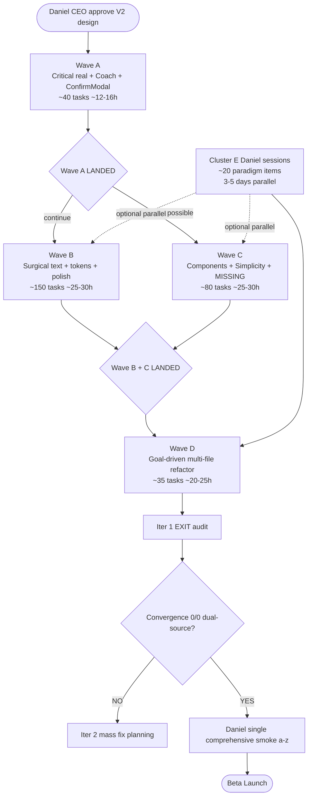
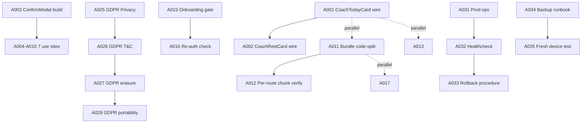
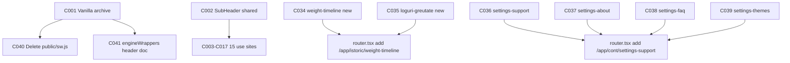
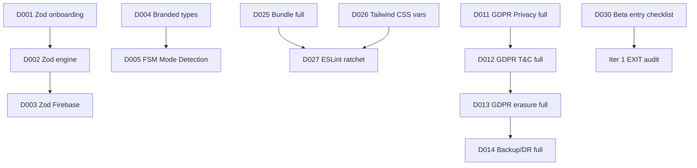

# _DAG V2 — Iter 1 Wave Dependency Graph

## §0 Critical path

---

## §1 Wave A — Critical real (BLOCKS Wave B+C+D)

**Hard dependencies BLOCKING Wave A → B+C:**
- A001 + A002 Coach engine wire BLOCKS C-class sub-screen wirings that reference Coach card props
- A003 + A004-A010 ConfirmModal shared + 7 uses BLOCKS SettingsDanger functional flows în Wave C
- A011 + A012 Bundle code-split BLOCKS Wave D bundle ratchet thresholds
- A013-A016 Auth gaps BLOCKS Wave C MISSING screens auth-gated routes testing
- A017-A020 security hygiene + A025-A028 GDPR BLOCKS Wave D D011-D013 functional verify (Wave D extends Wave A stubs)

**ETA Wave A:** ~12-16h Opus continuous (~2 calendar days single-session).

---

## §2 Wave B + Wave C — Parallel-safe post Wave A

Post Wave A LANDED, Daniel can spawn:
- **Session α:** PROMPT_CC_iter1_wave_b (Surgical text + tokens + polish ~150 tasks)
- **Session β:** PROMPT_CC_iter1_wave_c (Components + Simplicity + MISSING ~80 tasks)

**Parallel-safety analysis:**
- Wave B = surgical text + Pass 4 polish per-file (Antrenor + Splash + Auth + Progres + etc.) — mostly 1-3 LOC edits
- Wave C = new components (SubHeader + WorkoutPreview rich + Istoric heatmaps + MISSING screens) — file-additive primarily
- **Collision risk: LOW** — Wave B edits existing line-level text/tokens; Wave C adds new components + new files
- **Soft collisions:** Wave C C001 vanilla archive may touch tailwind.config.content scope — Wave B B083 brand token consolidation should LAND first OR sequence Wave B before Wave C if same session

**ETA hybrid Wave B + C parallel:** ~30h elapsed (max of two sessions).

---

## §3 Wave D — Sequential post Wave B + C

**Hard dependencies BLOCKING Wave D:**
- D001-D005 Zod + Branded + FSM REQUIRES Wave A bundle code-split LANDED (per-file lazy-import surface coherent)
- D011-D013 GDPR functional verify EXTENDS Wave A stubs A025-A028
- D014 Backup/DR runbook EXTENDS Wave A stubs A034 + A035
- D022 PWA UpdatePrompt EXTENDS Wave A A029 + A030
- D025 Bundle code-split full EXTENDS Wave A A011 + A012
- D026 Tailwind CSS vars EXTENDS Wave A A021 + Wave C C001 vanilla archive (clean purge scope)
- D029 deploy.yml verify EXTENDS Phase 7 LANDED + Wave A test changes

**ETA Wave D:** ~20-25h Opus continuous (~3 calendar days single-session).

---

## §4 Hybrid execution model (Daniel-orchestrated)

### §4.1 Single-session sequential mode (sustainable, slower)

Daniel paste 1 prompt at a time:
- Wave A (~2 days) → Wave B (~4 days) → Wave C (~4 days) → Wave D (~3 days) → EXIT audit (~2 days)
- **Total: ~15 calendar days**

### §4.2 Hybrid 2-session parallel mode (faster)

Post Wave A LANDED (single-session ~2 days):
- Session α: Wave B (~4 days)
- Session β: Wave C (~4 days) PARALLEL
- Daniel merges via per-task atomic commits (rare collision per §2 analysis)
- Post Wave B + C LANDED: Wave D single-session (~3 days)
- **Total: ~11 calendar days**

### §4.3 Cluster E Daniel parallel

Throughout Wave B/C/D execution, Daniel can run Cluster E paradigm sessions (3-5 short discussions ~30min each), totaling ~5-6h Daniel + ~5-10h CC implementation post-decision.

**Total iter 1 (Wave A-D + Cluster E + EXIT audit): ~11-15 calendar days.**

---

## §5 Wave-specific dependencies detail

### §5.1 Wave A internal dependencies

### §5.2 Wave C internal dependencies

### §5.3 Wave D internal dependencies (mostly sequential)

---

## §6 Cross-cluster hard dependencies (must respect)

| Dependency | Reason |
|------------|--------|
| Wave A → Wave B+C+D | Critical real foundations unblock all polish + components + refactor |
| A003 → C030+C031 SettingsDanger flows | ConfirmModal must exist before SettingsDanger use sites wire |
| A011+A012 → D025 | Wave A bundle code-split foundation extended in Wave D |
| C001 vanilla archive → D026 Tailwind CSS vars | Purge scope clean before Tailwind config migration |
| C002 SubHeader → C003-C017 + Wave C MISSING screens C034-C039 | Pattern adoption requires component exists |
| A025-A028 GDPR stubs → D011-D013 functional verify | Wave D extends Wave A stubs (don't double-write) |
| Daniel Cluster E decisions → Wave C paradigm-affected tasks (B013-B017 text-only safe, but C-cluster impl waits Daniel) |

---

## §7 Convergence iter 1 EXIT criteria

Per ORCHESTRATOR.md §8:

1. All 4 Waves (A+B+C+D) LANDED + Cluster E paradigm decisions implemented
2. Run audit-nuclear V4 procedure (D029 mirror) pe HEAD post-iter-1 — measure delta vs `b705c3f` baseline 56.5% production readiness
3. Run mockup-vs-prod parity V2 audit pe HEAD post-iter-1 — measure delta vs `caaae99` baseline 36% mockup parity
4. Run Track 7 systems scan (Tier 1+2+3)
5. Aggregate `_aggregate-findings-iter-1-exit.md`
6. Daniel CEO decision: CONTINUE iter 2 (if remaining ≥ ~100 dual-source) OR EXIT iter loop (if 0/0 dual-source) → Daniel single comprehensive smoke a-z → Beta launch

**Expected post-iter-1 closure:** ~75-80% of remaining ~870 findings → ~175-220 remaining → iter 2 needed.

**Total Beta gate path D042+D043 absolute:** ~11-15 days iter 1 + ~5-7 days iter 2 + ~3-5 days iter 3 residual (if needed) + ~1-2 days Daniel smoke = **~20-30 calendar days** post Wave A trigger.

---

🦫 **_DAG V2 — 4 Waves critical path. Wave A BLOCKS Wave B+C+D. Wave B+C parallel-safe. Wave D sequential. Cluster E Daniel parallel. ~11-15 days iter 1 hybrid mode.**
