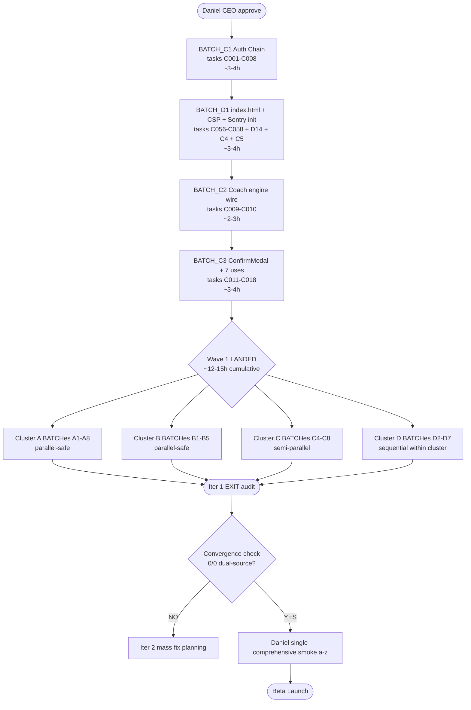
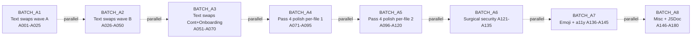
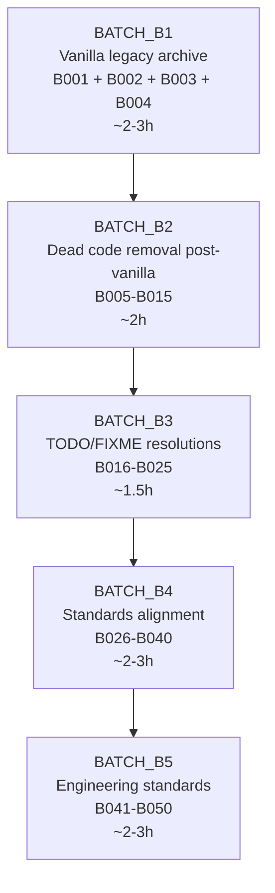
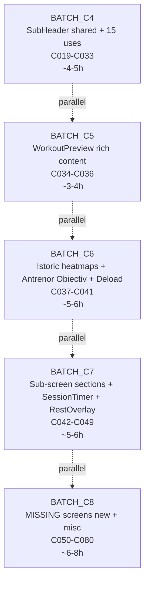
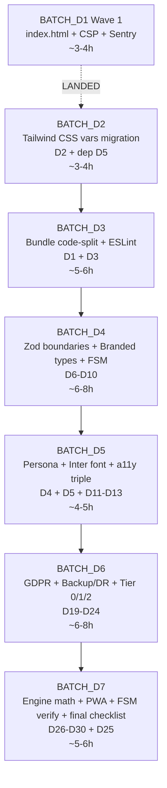

# _DAG — Iter 1 BATCH Dependency Graph

## §0 Critical path (Wave 1 — must run sequential, BLOCKS Wave 2)

## §1 Wave 1 critical path detail

### §1.1 BATCH_C1 — Auth Chain (8 tasks)

**Why Wave 1 critical:** ALL auth-gated /app/* screens inaccessible for end-to-end testing until C1 LANDED. Subsequent BATCHes touching auth-protected components cannot verify via real auth flow.

**Tasks:**
- C001 Auth.tsx wire sendMagicLink (NC§7-C2)
- C002 Auth.tsx Mock login DEV gate (NC§7-C1)
- C003 ProtectedRoute Firebase listener (NC§7-C3)
- C004 Sentry initSentry main.tsx + ErrorBoundary captureException wire (NC§4-C1 + §17-C1 + §13-C1)
- C005 Sentry beforeSend remove Firebase exclusion (NC§4-C5)
- C006 AuthCallback verify post-iter-9.6 LANDED + add Magic Link finalize (NC§7-related)
- C007 Onboarding T0 hard typing gate (NC§28 + §9)
- C008 SettingsDanger account-delete re-auth check (NC§31-H4)

**Pre-flight:** GitNexus `gitnexus_impact({target: "ProtectedRoute"})` + `gitnexus_impact({target: "Auth"})` + tests baseline 4522 PASS verify.

**Post-BATCH:** Daniel manual auth flow smoke (paste real email + click Magic Link + verify /app/antrenor renders).

**ETA:** ~3-4h Opus continuous.

### §1.2 BATCH_D1 — index.html + CSP + security headers + Sentry init

**Why Wave 1 critical:** Security baseline + production observability mandatory pre-Beta. Index.html rewrite blocks PWA manifest + theme-color verifications. CSP must precede new component additions (any inline scripts would break post-CSP).

**Tasks:**
- C056 index.html rewrite manifest + theme-color + apple-touch-icon + viewport-fit (NC§1-C1 cluster)
- C057 CSP + X-Frame-Options + X-Content-Type-Options + Referrer-Policy + Permissions-Policy meta (NC§4-C3 cluster)
- C058 .env.example template VITE_FIREBASE_* documentation (NC§4-C2)
- A121 Vite drop console + debugger (NC§1-C2)
- A122-A124 Console.warn removal scattered files (NC§1-C2 cluster)
- D014 deploy.yml test gate refactor (NC§33-C1+C2+C3)

**Pre-flight:** Daniel verify GitHub Secrets VITE_FIREBASE_API_KEY + VITE_FIREBASE_RTDB_URL set per D040.

**ETA:** ~3-4h Opus continuous.

### §1.3 BATCH_C2 — Coach engine wire (2 tasks)

**Why Wave 1 critical:** CoachTodayCard + CoachRestCard are most prominent Antrenor home UI — currently HARDCODED placeholder regardless of user state. Closing 5 CRIT findings via single Phase 5+ wire task. Antrenor home = first impression Gigel/Marius/Maria 65.

**Tasks:**
- C009 CoachTodayCard engine wire from getCoachToday aggregate (closes 3 CRIT)
- C010 CoachRestCard engine wire (closes 2 CRIT)

**Pre-flight:** `gitnexus_impact({target: "CoachTodayCard"})` + `gitnexus_impact({target: "CoachRestCard"})`. Read mockup andura-clasic.html:741-771 (today) + 791-820 (rest) line cited.

**ETA:** ~2-3h.

### §1.4 BATCH_C3 — ConfirmModal + 7 use sites (8 tasks)

**Why Wave 1 critical:** UX safety mandatory — destructive settings actions (logout / delete / reset / schimba-faza) functional but no confirms = catastrophic accidental data loss possible. Pattern P5 closes 7 CRIT findings via single shared component + 7 use sites.

**Tasks:**
- C011 ConfirmModal shared component build
- C012-C018 7 use-site wires (reset-coach + schimba-faza + redo-onboarding + logout + delete + program-change + finish-early)

**Pre-flight:** Read mockup confirm screens line cited (andura-clasic.html:2126 + 2141 + 2296 + 2311 + 2326 + 2363 + 2378). Existing AaFrictionModal + MedicalDisclaimerModal as reference for modal pattern (Radix UI Dialog from Phase 5 base).

**Parallelization:** C011 BLOCKS C012-C018 (component must exist first). C012-C018 parallel-safe across themselves (different use sites).

**ETA:** ~3-4h.

---

## §2 Wave 2 parallel-safe BATCHes (post Wave 1 LANDED)

### §2.1 Cluster A BATCHes (8 BATCHes, parallel-safe across themselves)

Daniel can spawn 2-3 concurrent CC sessions running:
- Session α: BATCH_A1 → A4 sequential within session
- Session β: BATCH_A5 → A8 sequential within session

**Parallel-safe:** different file scopes per BATCH (e.g., A1 touches mostly Antrenor + Auth + Splash files; A4 touches Pass 4 per-file polish across 8 distinct files).

**File-collision risk:** LOW within Cluster A (text swaps surgical 1-3 LOC, atomic commits rebase-friendly).

**ETA per BATCH:** ~3-4h. Total Cluster A: ~30h cumulative.

### §2.2 Cluster B BATCHes (5 BATCHes)

**Sequential within cluster** — B1 vanilla archive must LAND first (closes ~30 findings; subsequent B-tasks touch post-archived structure).

**Cross-cluster dependency:** B1 BLOCKS D2 (Tailwind ↔ CSS vars migration — vanilla legacy purge must be clean before tailwind.config.content scope adjustment).

**ETA Cluster B:** ~12.5h cumulative.

### §2.3 Cluster C BATCHes 4-8 (semi-parallel)

**Semi-parallel:** file-scoped — different sub-screens touch different files. Risk: shared component edits (e.g., CoachTodayCard already in BATCH_C2 closed; SubHeader in C4 used by C7 sub-screens — C4 must LAND before C7 starts).

**Hard dep:** C4 (SubHeader build) BLOCKS partial C7 (sub-screens applying SubHeader).

**ETA Cluster C BATCHes 4-8:** ~25-30h cumulative.

### §2.4 Cluster D BATCHes (7 BATCHes, sequential within cluster)

**Sequential** — multi-file refactors per BATCH = single CC session more reliable than parallel sessions touching same files concurrently.

**Cross-cluster deps:**
- BATCH_B1 BLOCKS BATCH_D2 (vanilla archive before Tailwind config)
- BATCH_C4 BLOCKS BATCH_D5 partial (SubHeader before persona hoist)
- BATCH_D5 (Inter self-host) BLOCKS C059 (SRI verify)

**ETA Cluster D:** ~32-35h cumulative (Wave 2 lane).

---

## §3 Cross-cluster hard dependencies (must respect)

| Dependency | Reason |
|------------|--------|
| BATCH_C1 → ALL Wave 2 | Auth wire unblocks auth-gated screen testing |
| BATCH_D1 → ALL Wave 2 | Security baseline mandatory pre-component-additions |
| BATCH_C2 → BATCH_C7 partial | Coach card props feed sub-screen wirings |
| BATCH_C3 (ConfirmModal) → SettingsDanger flows | Wire targets need shared component |
| BATCH_C4 (SubHeader) → BATCH_C7 sub-screens | Pattern adoption requires component exists |
| BATCH_B1 (vanilla archive) → BATCH_D2 (Tailwind CSS vars) | Purge scope must be clean |
| BATCH_D5 (Inter self-host) → C059 (SRI moot verify) | Self-host eliminates Google Fonts CDN dep |
| BATCH_C2 + BATCH_C3 → Cluster E paradigm sessions | Coach engine + ConfirmModal patterns must work before Daniel decides paradigm changes that depend on them |

---

## §4 Soft dependencies (preferred but not blocking)

| Soft dep | Reason |
|----------|--------|
| BATCH_A4 (Pass 4 polish) ← BATCH_D2 (Tailwind CSS vars) | If Tailwind CSS vars migrate first, polish tasks may need rework to use new utility names (`ink3` instead of `text-[#5c5852]`) |
| BATCH_A6 (env vars) ← BATCH_D1 (env infrastructure) | Cleaner if env infrastructure docs precede env var task |
| BATCH_C8 (MISSING screens) ← BATCH_C4 (SubHeader) | New sub-screens should use SubHeader pattern from day 1 |

---

## §5 Daniel-orchestrated multi-session execution model

### §5.1 Single-session sequential mode (sustainable, slower)

Daniel paste BATCH_NN prompt in 1 CC session at a time. Total iter 1: ~105h CC = ~13 working days @ 8h/day.

### §5.2 Multi-session parallel mode (~3 concurrent sessions, faster)

Post Wave 1 LANDED (single-session sequential, ~12-15h):

- **Session α (terminal 1):** BATCH_A1 → A2 → ... → A8 (~30h)
- **Session β (terminal 2):** BATCH_B1 → B2 → ... → B5 + BATCH_C4 → C5 → ... → C8 (~37-42h)
- **Session γ (terminal 3):** BATCH_D2 → D3 → ... → D7 (~30-35h)

**Daniel orchestration burden:** post-BATCH review checkpoint per session + git merge coordination if parallel sessions touch same file (rare per file-scope split).

**Total parallel mode:** max-of-sessions ~30-42h Opus + ~10-15h Wave 1 = ~40-55h elapsed = ~5-7 calendar days.

### §5.3 Recommended hybrid

Wave 1 single-session (mandatory sequential). Wave 2 dual-session (α Cluster A + B; β Cluster C + D) — reduces orchestration burden vs 3 concurrent.

**ETA hybrid:** ~7-10 calendar days iter 1 CC autonomous + ~3-5 days Daniel Cluster E sessions parallel = **~10-15 calendar days iter 1 complete**.

---

## §6 Convergence iter 1 EXIT criteria

Per ORCHESTRATOR.md §9:

1. All 28 BATCHes LANDED + Cluster E paradigm decisions implemented
2. Run audit-nuclear V4 (D029 mirror) pe HEAD post-iter-1
3. Run mockup-vs-prod parity V2 pe HEAD post-iter-1
4. Run Track 7 systems scan
5. Aggregate `_aggregate-findings-iter-1-exit.md`
6. Daniel CEO decision:
   - **CONTINUE iter 2** if remaining > ~100 dual-source
   - **EXIT iter loop** if remaining = 0/0 dual-source → Daniel single comprehensive smoke a-z → Beta launch

**Expected post-iter-1 closure:** ~70% of original ~890 findings → ~250 remaining → iter 2 needed (high-fidelity Pareto).

**Iter 2 estimated scope:** ~50% of iter 1 (~50-70h CC + ~10-20 Cluster E remaining items) → ~5-7 calendar days.

**Total Beta gate path (D042+D043 absolute):** ~15-25 calendar days iter 1 + ~10-15 iter 2 + Daniel smoke = **~30-45 calendar days** to Beta launch capable per current trajectory.

---

🦫 **_DAG iter 1 — Wave 1 critical path 4 BATCHes ~12-15h. Wave 2 parallel-safe 24 BATCHes ~30-45h hybrid mode. Total ~40-55h elapsed if 3-session parallel; ~105h if single-session.**
